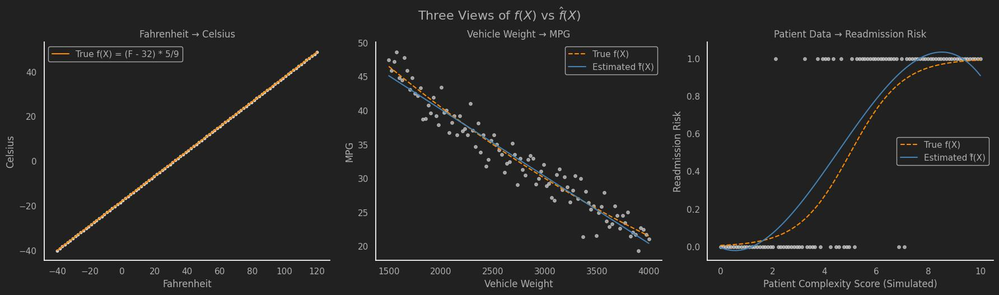

> Part 1
{: .prompt-info }

### The Secret Sauce

Hey.\
Hey you.\
Come closer.\
I have a secret to share: When it comes to machine learning, there is one function to rule them all.\
\
\begin{eqnarray}
  Y = f\left( X \right) + \epsilon \tag{1}\\
\end{eqnarray}
\
There you go, now you know how every machine learning algorithm out there works!\
See you next time!\
\
...\
\
Oh, you're still here?  I guess giving you that equation and saying "you now understand how machine learning algorithms work" is like handing you a hammer 
and saying "you can now build a house". Let's see if I can break it down a bit more and give you a more concrete example to see if that helps.\
\
\begin{align\*}
  Y = f(X) + \epsilon \\\\ 
\end{align\*}
Where:  
- $$Y$$: The predictions or output of the function  
- $$X$$: The input values to your function  
- $$f(X)$$: Any function you can imagine that relates X to Y
- $$\epsilon$$ (epsilon): A catch-all value for error  

The phrase “any function you can imagine” might sound vague, so let's clarify. What I mean is that any equation you've ever seen—whether it's a simple, recognizable one like the 
equation for a line, $$y = mx + b$$ or something as complex as the equations that define a [Long Short Term Memory (LSTM) Cell](https://colah.github.io/posts/2015-08-Understanding-LSTMs/)
—they're all just different functions that transform input into output.  So whenever you see $$f(X)$$ (pronounced "F of X"), just know that you are passing some input data ($$X$$) into
 a function, equation, or series of equations, and you now expect some output data ($$Y$$).

### The Difference maker: $$\epsilon$$

At this point, you could go out and start implementing algorithms to make predictions on anything and everything.  But before you do, there's one small detail that can make or 
break your models (and possibly your will to continue in this field): $$\epsilon$$.  This little variable, tacked onto the end of our equation $$(1)$$, is more important than it might seem.  
It acts as a  catch-all that fills in the gap between the output of your function $$f(X)$$ and the *true* relationship between your inputs ($$X$$) and their actual outputs.  In other words, $$\epsilon$$ reminds us that our model will never perfectly capture reality—there's always some level of uncertainty, missing information, or randomness at play.

Even with the perfect function, there's always some amount of randomness, noise, or plain-old unpredictability that slips through the cracks.  This is why $$\epsilon$$ is referred to as **irreducible error**.  

For example, if you’re building a model to predict temperature, two thermometers might give slightly different readings even in the same location. This difference could be due to calibration differences, sensor lag, or even shade vs. sunlight. That difference? That’s epsilon waving at you from the shadows.  That’s not your model’s fault—that’s the world being messy. Or imagine trying to predict how long it’ll take someone to drive to work. Sure, you can model distance and speed, but what about surprise traffic, road work, or a rogue duck crossing the street? That’s $$\epsilon$$ in action: the unpredictable noise we can’t ever quite model away.

So, you might be saying: "That's all good and dandy, but how do I go from this equation to something I can actually use in the real world?" That is a the perfect segue into the next section,
unfortunately for you and for this article's writing flow, there is one more thing that I want to mention to really drill home the importance of $$f(X)$$.

### Why the "F" does it matter?

In reality, there is a second equation that we will be working with:
\begin{eqnarray}
  \hat{Y} = \hat{f}(X) \tag{2}\\\\ 
\end{eqnarray}

This equation introduces the 'hat' symbol ( $$\hat{Y}$$, pronounced 'Y hat' ), which tells us that what we are looking at is an estimation and not necessarily the "true" function. In our case, 
the 'hat' symbol tells us that $$\hat{Y}$$ is not the actual output, but rather our model's best estimate based on the available data. Similarly, $$\hat{f}(X)$$ represents our approximation 
of the "true" relationship between $$X$$ and $$Y$$. 

Here we are again, I've been using this "true" wording without fully clarifying what this means.  When we have any dataset, our first assumption 
is that this data is **not** all of the data that we could possibly gather around this subject.  Another way to phrase this is: the data we have is just a **sample**. 
For example, if we wanted to understand the height of the average human, we could go door to door around the world and collect every single person's height. But this would take forever. 
Instead, we collect information from far fewer people around the world and treat that as a decent representation of the total human population.  The more people we gather information from, 
the closer our sample's average height will be to the true average height of all humans. Since most of our datasets are just samples rather than the entire population, when we create models, 
we are only producing estimations of the "true" model.  When you see equation $$(2)$$, think: 
> This is only an estimation of the 'true' relationship between $$X$$ and $$Y$$ because we don't have all the data needed to produce equation $$(1)$$.

Since we almost never have access to the full population data, our focus when building models is to build them such that we generalize well from samples. Our goal is to find an $$\hat{f}(X)$$ 
that approximates $$f(X)$$ while minimizing error, ensuring that our model performs well not just on our sample, but on unseen data too. 

Let's see this in action with simulated data in the context of our three running examples:

  

 
Each panel shows a different kind of relationship between our input ($$X$$) and output ($$Y$$)—from perfectly predictable to messy and chaotic.

- **🧪 Fahrenheit → Celsius (Left Panel):**  
  This is function fitting at its most pure. The orange line ($$f(X)$$) and the blue line ($$\hat{f}(X)$$) are identical—no noise, no error, just a perfect linear relationship. This is what happens when the world behaves.

- **🚗 Vehicle Weight → MPG (Middle Panel):**  
  Real-world data rears its head. The orange line represents the underlying (but unknown) curved trend, while our model ($$\hat{f}(X)$$) fits a simple straight line. It's close, but not perfect. Here’s where error—both irreducible and from model choice—starts to show up.

- **🏥 Patient Complexity → Readmission Risk (Right Panel):**  
  Now we’re deep in the weeds. The data is noisy, the relationship isn’t linear, and our model is doing its best to estimate some kind of pattern. The gap between $$f(X)$$ and $$\hat{f}(X)$$ becomes more obvious—and more important to understand.

Together, these examples show how the same core idea, learning a function from data, plays out across levels of complexity. As we progress through this series, we’ll keep coming back to these examples to see how different tools handle that challenge.

At its core, machine learning about finding functions that map inputs to outputs. But just knowing that $$Y=f(X)+\epsilon$$ exists isn’t enough—we need a way to actually estimate $$f(X)$$ and, ideally, we want the best possible estimate given the data we have.  With that in mind, let us turn our focus to the most simple but foundational concept in machine learning: *Ordinary Least Squares (OLS)*.
